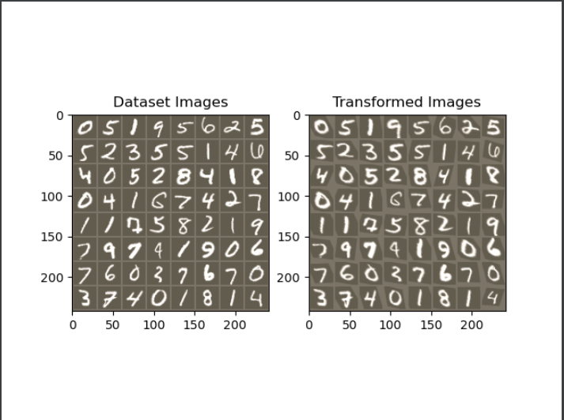

# stn
使用 pytorch进行Spatial Transformer Networks（STN）的实现  
参考自pytorch官网教程  
环境配置： python3.8 pytorch1.8(GPU) torchvision 0.5.0 matplotlib numpy  
***  
普通的CNN能够显示的学习平移不变性，以及隐式的学习旋转不变性，但attention model 告诉我们，与其让网络隐式的学习到某种能力，不如为网络设计一个显式的处理模块，专门处理以上的各种变换。因此，DeepMind就设计了Spatial Transformer Layer，简称STL来完成这样的功能。
***  
主要思想：用网络学得一个3*2的变换矩阵从而显式的完成图像的平移旋转等等功能  

